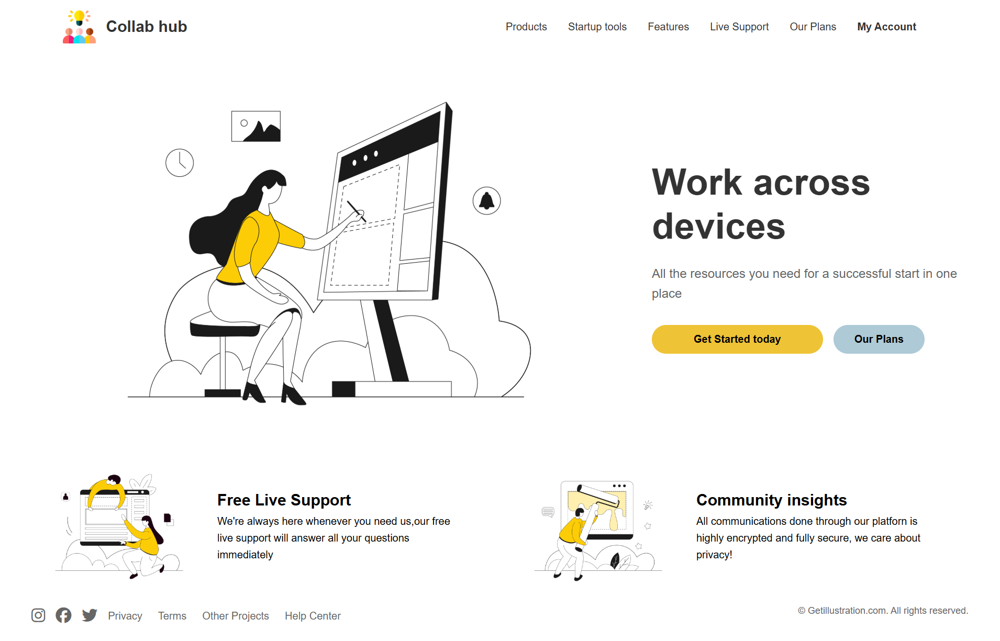

# Task-1 Landing Page with Angular

## My Screenshots



## Referenced Screenshot


## How to Start the Project

To start the project, follow these steps:

1. **Install the dependencies:**

```bash
npm install
```

2. **Run the development server:**

```bash
ng serve
```

3. **Open your browser and navigate to:**

```
http://localhost:4200
```

## References

- [Angular Documentation](https://angular.dev/overview)
- [Getting Started with Angular](https://angular.dev/tutorials)
